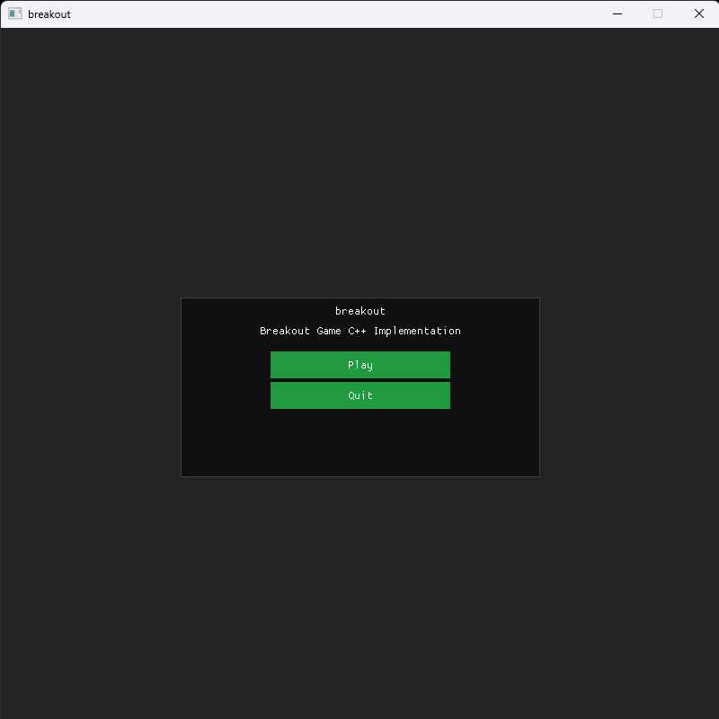
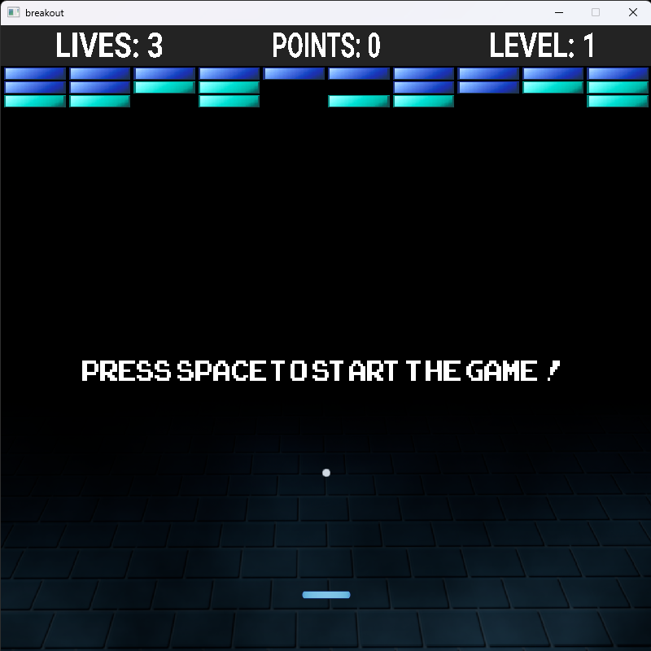
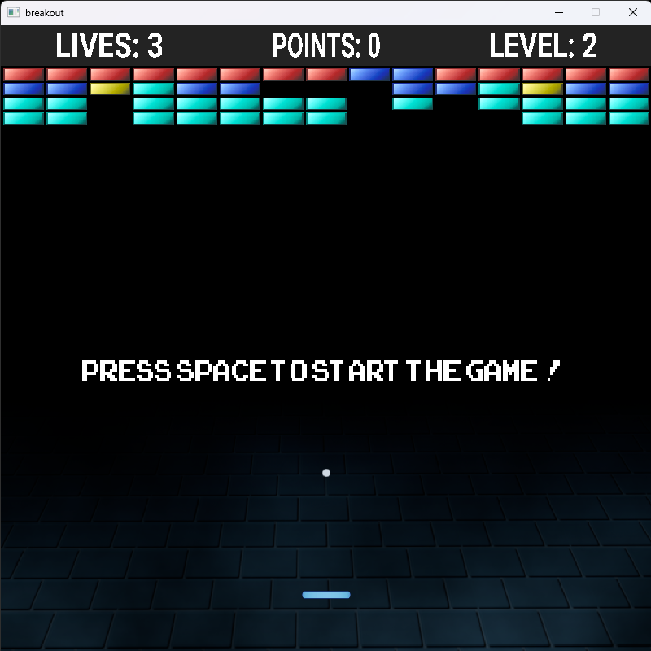

# breakout

This is a C++ breakout game implementation. The code uses C++17. Visual studio solution is provided with configured builds for Debug and Release but only for x64 architecture.
Dependencies are contained in the `deps/` folder and assets are contained in the `assets/` folder. Dynamic libraries and assets are automatically copied to the build directory by using post-build events.

## Build instructions
You can either clone the repo or download the source from the Github Releases page. Open the Visual Studio Solution (.sln) file and simply build the configuration you want (Debug or Release).

### Build warnings
The only existing warnings come from `SDL_stdinc.h` header file. The rest of the files should compile with no issues (errors or warnings).

## Running the game
You can download the release build of the game under the Github Releases page. It contains the built application, dynamic libraries and assets needed to run the game. Simply extract the .zip file and run the application.

## Screenshots

### Main menu built with imgui

### First level of the game

### Second level of the game
